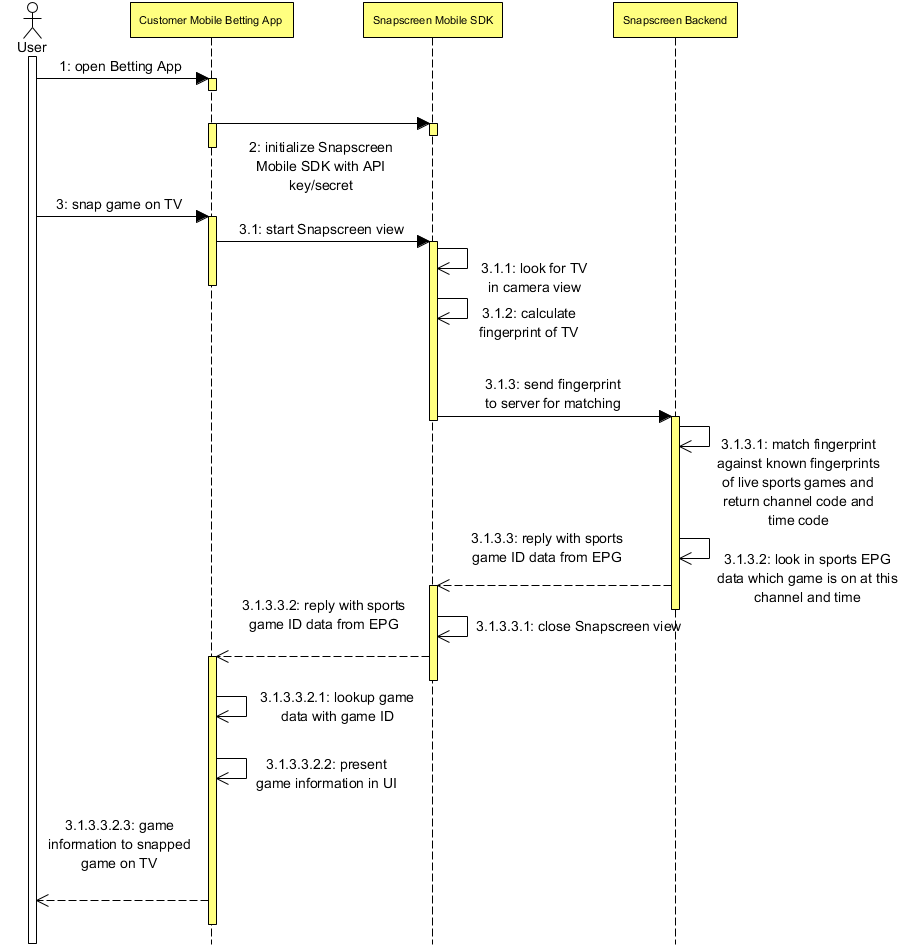

## Documentation

For the full API documentation go to https://snpscrn.github.io/sdk-android

## Support
In case of any questions or problems please contact us at [support@snapscreen.com](mailto:support@snapscreen.com).

# Snapscreen SDK Description

## Requirements

We assume that you already have an Android project in Android Studio or another Android IDE. The SDK runs on devices with Android 4.0.3, 4.0.4 (API Level 15) or later, but you need to build your app with Android SDK 7.1 (Level 25) or later for the integration with Snapscreen SDK.

## Setup

We recommend integration of our compiled library into your project using Android Studio and Gradle.

### 1. Obtain an application client id and client secret

Snapscreen Team should provide you required client id and client secret.

### 2. Get the SDK

Add the jcenter maven repository for the Snapscreen SDK by adding the following entry under repositories in your top-level build.gradle:

```

buildscript {
    repositories {
		maven {
			url "https://dl.bintray.com/snapscreen/snapscreen-sdk"
		}
	}
	// most-like jcenter() and/or mavenCentral()
}

```

Add the SDK to your app module's dependencies in Android Studio by adding the following line to
your

```
compile 'com.snapscreen.mobile:snapscreen-sdk'
```

Note that the Snapscreen SDK also already contains several dependencies to Android Support Libraries
as well as to Retrofit and RxJava.

```
	compile 'com.android.support:appcompat-v7:25.3.1'
	compile 'com.android.support:recyclerview-v7:25.3.1'
	compile 'com.squareup.retrofit2:retrofit:2.1.0'
	compile 'com.squareup.retrofit2:converter-gson:2.1.0'
	compile 'io.reactivex:rxjava:1.1.6'
	compile 'io.reactivex:rxandroid:1.2.1'
	compile 'com.squareup.retrofit2:adapter-rxjava:2.1.0'
	compile 'com.squareup.retrofit2:converter-gson:2.1.0'
	compile "com.snapscreen.matching:snapscreen-matching-client:0.14.0"
	compile 'com.squareup.okhttp3:logging-interceptor:3.3.0'
	compile 'de.greenrobot:eventbus:2.4.0'
	compile 'com.android.support:percent:25.3.1'
	compile 'com.google.guava:guava:18.0'
	compile 'org.apache.commons:commons-lang3:3.2'
	compile 'org.apache.commons:commons-collections4:4.0'
	compile 'commons-io:commons-io:2.4'
```

If you have incompatibility issues or want to include a newer minor version of one of the dependencies in your own project, you can exclude certain groups by adding the snapscreen sdk dependency the following way (the module appcompat-v7 from the Android Support Library is taken as an example here). You can also exclude a whole group. Please not that if you exclude any of the support libraries and replace them with a newer version in your project, you should do so for all referenced com.android.support dependencies mentioned above and use the same version for all of them!

```
compile('com.snapscreen.mobile:snapscreen-sdk') {
	exclude group: 'com.android.support', module: 'appcompat-v7'
}
```

### 3. Integrate Snapscreen SDK

Open your class that extends Application class.

Add line that initialize Snapscreen SDK.

```
public class SnapApplication extends Application {
    @Override
    public void onCreate() {
        super.onCreate();
        SnapscreenKit.init(this, {CONSUMER_KEY}, {SECRET}, {connectToTestEnvironment}, {listener});
    }
}
```

## Snapping TV content

### 1. Start SnapActivity with configuration

```
SnapConfiguration configuration = new SnapConfiguration();
configuration.setSearchForTvResults(true);
context.startActivityForResult(SnapActivity.getIntentForContext(getContext(), configuration), requestCode);
```

### 2. Get the result of snapping

```
class YourActivity extends Activity {
    @Override
    public void onActivityResult(int requestCode, int resultCode, Intent data) {
        super.onActivityResult(requestCode, resultCode, data);
        if (requestCode == RESULTS_CODE && resultCode == Activity.RESULT_OK) {
            SearchResult searchResult = data.getParcelableExtra("result");
            if (searchResult.getTvSearchResult()) {
                // Handle TV Search results
            }
        }
    }
}
```

## Snapping Sports Content

### 1. Start SnapActivity with configuration

```
SnapConfiguration configuration = new SnapConfiguration();
configuration.setSearchForSportEvents(true);
context.startActivityForResult(SnapActivity.getIntentForContext(getContext(), configuration), requestCode);
```

### 2. Get the result of snapping

```
class YourActivity extends Activity {
    @Override
    public void onActivityResult(int requestCode, int resultCode, Intent data) {
        super.onActivityResult(requestCode, resultCode, data);
        if (requestCode == <requestCode you passed to activity> && resultCode == Activity.RESULT_OK) {
            SearchResult searchResult = data.getParcelableExtra("result");
            if (searchResult.getSportsMatchSearchResult()) {
                // Handle sports results
            }
        }
    }
}
```


The following sequence diagram shows the flow between your app, the SDK and the Snapscreen backend.



## Snapping Advertisements

### 1. Start SnapActivity with configuration

```
 SnapConfiguration configuration = new SnapConfiguration();
 configuration.setSearchForAdvertisements(true);
 context.startActivityForResult(SnapActivity.getIntentForContext(getContext(), configuration), requestCode);
```

### 2. Get the result of snapping

```
class YourActivity extends Activity {
    @Override
    public void onActivityResult(int requestCode, int resultCode, Intent data) {
        super.onActivityResult(requestCode, resultCode, data);
        if (requestCode == <requestCode you passed to activity> && resultCode == Activity.RESULT_OK) {
            SearchResult searchResult = data.getParcelableExtra("result");
            if (searchResult.getAdvertisementSearchResult()) {
                // Handle advertisement results
            }
        }
    }
}
```

## Web Search

In order to perform searches for web content first acquire an instance of the WebSearchService:


```
WebSearchService webSearch = SnapscreenKit.getInstance().getWebSearchService();
```

After you have acquired the WebSearchService, by calling one of the search methods. SnapscreenKit internally uses Retrofit 2 and exposes RxJava methods that return Observables for making web searches:

```
SnapscreenKit.getInstance().getWebSearchService().searchSites("Search term", "locale", "channelCode", SnapscreenKit.getInstance().getCurrentSnapscreenTimestamp(), <page>, <pagesize>)
    .subscribeOn(Schedulers.io())
    .observeOn(AndroidSchedulers.mainThread())
    .unsubscribeOn(Schedulers.io())
    .subscribe(new Subscriber<WebSearchResponse>WebSearchSiteResult>>() {
        @Override
        public void onCompleted() {

        }

        @Override
        public void onError(Throwable e) {

        }

        @Override
        public void onNext(WebSearchResponse<WebSearchSiteResult> response) {
            if (response.getWebSearchEntries() != null) {
                // Do something with results
            } else {
            }
        }
    });
```

Use searchSites(...) method for searching web-pages, searchImages(...) - for images, searchVideos(...) - for
videos.

## Displaying Web Search Results

When you are displaying a web search result, you need to use the visitUrl of the corresponding WebSearchResult to resolve the actual result page and also have Snapscreen track the visit to this result. This is necessary to correctly provide feedback to Snapscreen in order to provide ranking and priorization for the web results.

## Using with a simulator or emulator

For snapping SnapscreenKit has dependencies to native libraries which are only available on actual devices. In order to still be able to develop the rest of your application and all features of SnapscreenKit not related to snapping, you need to add the following configuration in the android section of your application's build.gradle. The universalApk option set to true makes sure that when you are building your application, a universal APK is generated that contains all APK splits just like without the splits option.

```
splits {
    abi {
        enable true
        reset()
        include 'armeabi-v7a', 'mips', 'x86'
        universalApk true
    }
}
```
